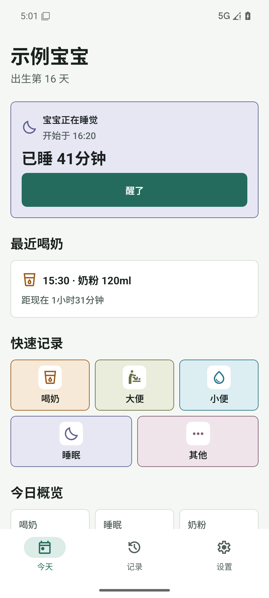
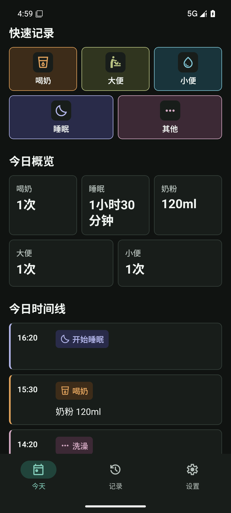
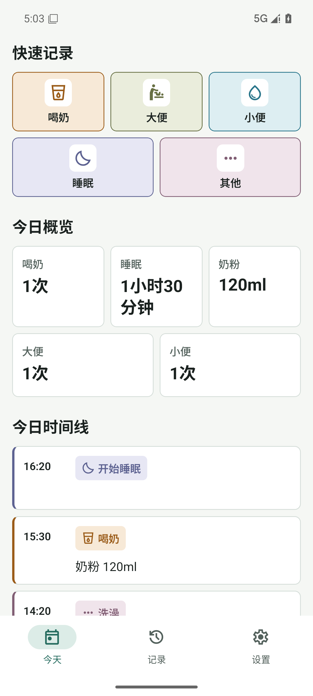
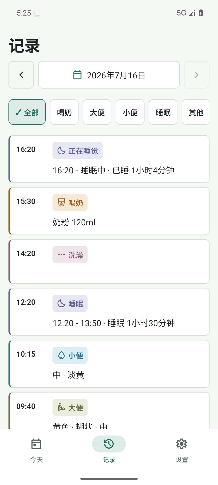
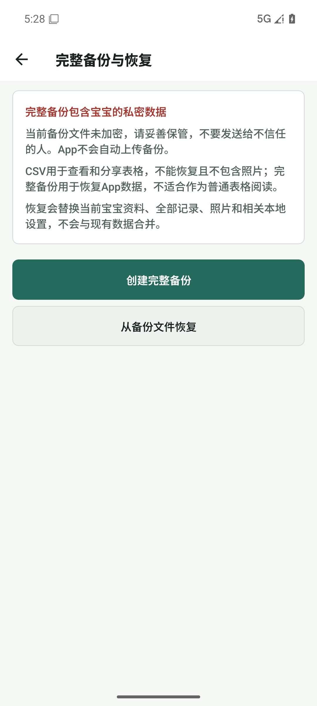

# 宝宝今天

《宝宝今天》是一款面向主要照护者的新生儿日常记录应用，重点是在抱娃、换尿布、冲奶和夜间照护时，用尽量少的操作完成记录并回顾当天情况。

A privacy-first, local-first newborn care tracking app, currently implemented and validated for Android.

Android 功能基线已经完成，当前公共源码包含 API 36 安全区兼容性修复。iOS 仍在计划中，尚未开始构建或验收。第一阶段公共仓库只提供源码，不提供 APK 或 AAB。

## 当前源码状态

- Current source version: Android 1.0.1 / versionCode 4
- API 36 edge-to-edge safe-area fix included
- Android source and UI flows validated through automated tests and an API 36 emulator
- iOS has not been built or tested
- No APK/AAB is published in this repository

## 功能

- 宝宝基础资料：昵称和出生日期。
- 五类日常记录：喝奶、大便、小便、睡眠和其他事项。
- 今天页与历史页：按本地日期查看统一时间线。
- 大便照片：拍照或从相册选择后保存在应用管理的本地目录。
- 喝奶提醒：由 Android 本地通知安排，不使用推送服务。
- 浅色、深色和跟随系统主题。
- CSV 导出：用于查看和分享表格数据。
- ZIP 完整备份与恢复：包含宝宝资料、五类记录、设置和大便照片。

## 界面截图

以下截图全部使用虚构的“示例宝宝”和虚构记录，不含真实家庭资料。

| 今天页（浅色） | 今天页（深色） |
| --- | --- |
|  |  |

| 快速记录与今日时间线 | 历史记录 |
| --- | --- |
|  |  |

| CSV 导出 | 完整备份与恢复 |
| --- | --- |
|  |  |

截图目录中还保留喝奶记录、进行中睡眠和设置页，供查看相应功能界面。

## 技术栈

- Expo SDK 57.0.4
- React Native 0.86.0 / React 19.2.3
- TypeScript 6.0.3 / Expo Router 57.0.4
- Expo SQLite 57.0.0
- Jest 29.7.0 / jest-expo 57.0.1

依赖的精确版本以 `package-lock.json` 为准。Expo SDK 57 的版本化文档见 [Expo SDK 57 文档](https://docs.expo.dev/versions/v57.0.0/)。

## 本地数据架构

SQLite 是业务数据的事实来源，当前 `user_version=8`。代码按职责分为：

- `src/domain`：业务类型、校验、日期、统计和导出/备份格式规则。
- `src/application`：用例服务，协调数据仓库、照片、通知和文件能力。
- `src/data`：SQLite 仓库及 Expo 文件、分享、照片和通知适配器。
- `src/features`：功能界面与交互。
- `src/app`：Expo Router 路由入口。

应用没有产品服务器、远程 API 或云数据库。更完整的设计见 [架构说明](docs/ARCHITECTURE.md)。

## 隐私设计

- 无账号、无服务器、无云数据库、无多设备同步。
- 不集成广告、分析服务或 Expo Push Token。
- 宝宝资料和五类记录默认保存在当前设备的本地 SQLite 数据库中；大便照片保存在应用管理的本地文件目录中。
- CSV 仅用于查看和分享，不包含照片，也不是完整备份。
- ZIP 是完整本地备份，但当前未加密，需要用户自行安全保存。
- Android 系统级自动备份或设备迁移可能按系统策略处理应用数据；这与应用主动上传或产品同步不同。

详情见 [隐私说明](PRIVACY.md) 和 [数据导出与备份](docs/DATA-PORTABILITY.md)。

## 开发环境

建议使用：

- Node.js 22.13 或更高版本（封板验证使用 Node.js 24）
- npm 11
- JDK 17
- Android Studio、Android SDK，以及 Android 模拟器或已授权的真机

在 Windows 上建议把项目克隆到名称较短、仅含 ASCII 字符的目录，以减少原生工具链的路径兼容问题。

安装依赖：

```bash
npm ci
```

## 启动方式

首次创建并安装 Android development build：

```bash
npm run android
```

之后仅修改 JavaScript/TypeScript 时，启动 Metro 并从设备打开已安装的 development build：

```bash
npm run start:dev-client
```

项目使用原生模块，普通开发以 development build 为准。安装或升级原生依赖、修改 config plugin 或原生配置后，需要重新运行 `npm run android`。

## 自动测试

```bash
npm test -- --runInBand
npm run test:schema
npm run typecheck
npm run lint
npm run test:assets
npx expo-doctor
npx expo config --type public
npx expo export --platform android --output-dir dist
```

`test:schema` 检查宿主 SQLite 的迁移与 schema 契约；它不替代 Android 上的原生 SQLite 集成验证。测试范围和 Android 验证边界见 [测试说明](docs/TESTING.md)。

## Android 开发构建

`npm run android` 使用 Expo 的本地 Android 工具链生成并编译 development build。普通开发构建不需要 release keystore，也不需要仓库外的签名配置。生成的 `android/`、Gradle 缓存和构建产物均被忽略，不应提交。

本仓库不提供正式签名、APK/AAB 发布或应用商店上架流程。第一阶段也不会把 APK/AAB 提交到 Git。

## 当前限制

- 当前仅完成 Android 版本；iOS、Web 均未完成产品验收。
- 面向单设备上的一名主要照护者，没有家庭协作或多设备同步。
- 本地通知受权限、省电、勿扰和设备厂商后台策略影响，不保证精确送达。
- CSV 不包含照片，不能用于完整恢复。
- ZIP 备份未加密；系统分享后的文件处理由用户选择的应用负责。
- 不提供账号恢复、云端恢复或远程数据删除能力。
- 第一阶段公共仓库不提供 APK/AAB。

## 路线图

1. 收集 Android 1.0.1 源码的公开反馈并进行必要维护。
2. 单独规划和实施 iOS 构建、设备验证与发布准备。
3. 另行决定是否通过 GitHub Releases 提供正式 Android APK；AAB 不提交源码仓库。

## AI 辅助开发说明

本项目在需求梳理、实现建议、测试设计和文档整理中使用了 AI 辅助工具。产品取舍、代码审查、验收标准、真机验证和最终发布决策由维护者负责。AI 生成内容不替代人工审查、设备测试或专业意见。

## 非医疗产品免责声明

《宝宝今天》是日常记录工具，不是医疗器械，不提供诊断、治疗、用药、喂养或健康风险判断。界面中的颜色、数量、间隔和统计仅用于记录与回顾。如对宝宝健康有疑问，请及时咨询合格的医疗专业人员。

## 版权与许可

Copyright © 2026 ZestJT（钟锦涛）. All rights reserved.

本仓库源码公开供查看。除适用法律或另行书面授权外，不授予复制、修改、分发、再许可或商业使用权利。

根目录未提供开源 `LICENSE`。第三方组件和素材仍分别适用其原始许可证，见 [第三方声明](THIRD_PARTY_NOTICES.md)。在 GitHub 上公开查看或 fork 还会受 GitHub 服务条款约束；这不构成维护者授予额外的软件许可。
