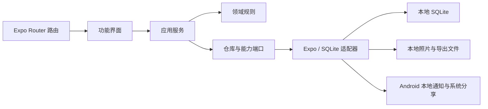

# 架构说明

## 产品边界

《宝宝今天》Android 1.0.1 当前源码是单设备、本地优先的照护记录应用。它没有账号、产品服务器、远程 API、云数据库或多设备同步。SQLite 是宝宝资料、记录和设置的业务事实来源，照片与导出文件由应用管理的本地文件适配器处理。

## 分层

- `src/app`：路由、布局和页面入口，不承载持久化逻辑。
- `src/features`：表单、列表、状态展示和用户交互。
- `src/application`：应用用例与跨资源协调，例如保存记录、安排提醒、导出和恢复。
- `src/domain`：纯业务类型、校验、日期、统计、派生字段与格式契约。
- `src/data`：SQLite repository，以及照片、通知、文件选择、压缩、哈希和分享适配器。

界面不直接执行 SQL。应用服务通过端口调用 repository，使领域规则和数据实现保持可独立测试。

## SQLite

当前 schema 版本为 `user_version=8`。数据库包含宝宝资料、统一记录、主题设置和喝奶提醒设置。五类记录为：

- `feeding`：母乳、奶粉或混合喂养及相应数量/时长。
- `poop`：颜色、性状、量和可选照片引用。
- `pee`：颜色和量。
- `sleep`：开始、结束和进行中状态。
- `other`：标题和备注。

迁移按版本顺序在排他事务中执行，并检查关键约束、外键和完整性。记录同时保存事件时间和当时计算的本地日期，以便跨时区恢复后仍保持历史日期归属。

## 本地照片

大便照片由照片存储适配器复制到应用管理目录；SQLite 只保存受控引用。新增、替换和删除记录时，应用服务协调数据库与照片文件，并在启动时清理失去引用的受管照片。照片不会由产品服务器处理。

## 本地提醒

喝奶提醒基于最近一次喝奶记录和用户选择的间隔计算。应用只安排 Android 本地通知，不获取推送 Token。启动和回到前台时会执行提醒 reconciliation，使数据库设置和系统中已安排的通知收敛到一致状态。

系统权限、省电、勿扰、强行停止和厂商后台策略都可能影响实际送达；提醒不是精确闹钟或医疗提醒。

## 导出与恢复

CSV 服务从同一 SQLite 快照生成稳定列顺序的表格。ZIP 备份服务从 SQLite 快照和受管照片生成完整归档；恢复前先在暂存区校验结构、大小、哈希和业务约束，然后执行替换式恢复。详情见 [数据导出与备份](DATA-PORTABILITY.md)。

## 主题与 UI

浅色、深色和跟随系统主题由语义化 token 驱动，并同步到路由容器、页面和 Android 原生界面元素。五类记录使用低饱和识别色，不根据记录内容给出健康判断。
